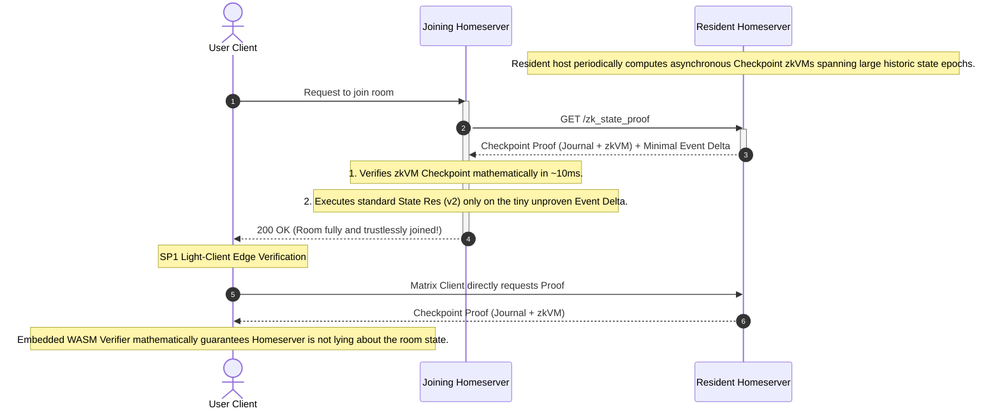

# MSC0000: Trustless ZK-Proven Federated Room Joins

**Author:** [@gamesguru](https://github.com/gamesguru)
**Created:** 2026-03-23
**Updated:** 2026-05-02
**Status:** Draft

## Introduction and Motivation

The Matrix protocol is built on a fully decentralized "don't trust, verify" architecture. Currently, when a homeserver joins a federated room, it has two theoretical paths:

Today joins are either "full" or "partial," with full joins being relatively slow (but secure) and partial joins being faster (but placing a lot of trust in the originating server).

This proposal adds an alternative (and one day perhaps a non-negotiable replacement) to partial joins.

Using zero-knowledge proofs (specifically, Graph-Native STARKs operating over binary fields), homeservers can generate proof of correct topological reduction over a room's DAG. The proof is uniquely identified by a canonical Verification Key hash (`VK_HASH`) bound to the room version.

This proof doesn't generally happen in real time, but as a periodic background process. Resident servers then cache a checkpoint or "rollup" and use it for a few days or a week before generating a new one. During this time, they send it (along with any events from the past week, the "delta") to anyone requesting a join. If unavailable, they fall back to an agreed protocol (either full or traditional partial joins).

## Scope and General Recommendations

_Caveats and Restrictions (Roadmap)_

Due to the relative immaturity of zero-knowledge frameworks (Ethereum uses them, but with some performance issues), partial joins are an ideal candidate for early adoption. They already occur today fully trusting the resident homeserver. This proposal aims to remove that need for trust and make the system fully secure and fully automated.

If the endpoint fails for whatever reason, servers are allowed to fall back to full join or, if they choose, to less cryptographically-secure partial joins.

Servers that already support partial joins are encouraged to expose the ZK endpoints for servers that only support full joins. They are encouraged to also consume the endpoint whenever exposed by other servers. This may increase to a strict requirement before the MSC is merged (depending on results and feedback from early testing).

Clients may also leverage these proofs via a WASM or Android/iOS FFI binding, but as of today, I make no such enforcement or recommendation. Unless client developers overwhelmingly request the addition of endpoints to pull the proofs down for edge-verification, I am not planning to include client endpoints in the initial spec. It adds too much development work to their backlog. If all goes well, we can add more features in a follow up MSC.

## Proposed Endpoints

We propose a new versioned endpoint under the Federation API designed specifically for ZK-Joins.

### `GET /_matrix/federation/unstable/org.matrix.msc0000/zk_state_proof/{roomId}`

Retrieves the latest cryptographic state checkpoint for the specified room, alongside the unverified event delta since that checkpoint.

**Authentication:** Requires Server-Server signature.
**Rate-limiting:** Yes.
**Guest access:** This endpoint is not available to guest accounts. Guests MUST NOT be able to retrieve ZK state proofs.

**Path Parameters:**

- `roomId` (string, required): The ID of the room to join (e.g. `!abcd:example.com`).

**Response Format:**

Returns an HTTP 200 OK with the following JSON body:

```json
{
  "room_version": "12",
  "vk_hash": "sha256:<hex_digest>",
  "checkpoint": {
    "event_id": "$historic_event_X",
    "public_journal": {
      "da_root": "0xc29ab9db...",
      "state_root": "0x259df515...",
      "h_auth": "0x7f3a1b2c...",
      "n_events": 43543,
      "prover_id": "0x...",
      "proof_timestamp": 1746230400,
      "epoch_range": [0, 43543],
      "merge_base": null,
      "parent_proofs": ["0x...", "0x..."]
    },
    "zk_proof_bytes": "<base64_stark_proof>",
    "prover_signature": {
      "server_name": "matrix.org",
      "key_id": "ed25519:abc123",
      "signature": "<base64_signature>"
    }
  },
  "delta": {
    "recent_state_events": [
      {
        /* Raw State Event 1 (happened since checkpoint) */
      },
      {
        /* Raw State Event 2 (happened since checkpoint) */
      }
    ]
  }
}
```

**Response Payload Details:**

- `room_version` (string): The Matrix room version, which dictates the state resolution rules and the expected `VK_HASH`.
- `vk_hash` (string): SHA-256 of the verification key for the arithmetic circuit. MUST match the canonical hash for this `room_version`.
- `checkpoint` (object): The cryptographic rollup data spanning the room's history up to the cutoff.
  - `event_id` (string): The Matrix event ID representing the deterministic cutoff point for the rollup.
  - `public_journal` (object): Public inputs committed to the STARK proof's Fiat-Shamir transcript. See [Public Journal Schema](#public-journal-schema) below.
  - `zk_proof_bytes` (string): The base64-encoded STARK proof payload (~150–250 KB).
  - `prover_signature` (object): The generating server's signature over `canonical_json(public_journal)`. See [Proof Signing](#proof-signing) below.
- `delta` (object): The minimal, unverified Auth Chain events that have accumulated strictly after the `checkpoint.event_id`.
  - `recent_state_events` (array of objects): Standard Matrix state events (PDUs). The joining server will natively execute standard state resolution over these final events on top of the checkpoint. Servers SHOULD generate fresh proofs frequently enough to keep the delta under 1,000 events. If the delta exceeds 10,000 events, the resident server SHOULD generate a new proof before serving this endpoint, or respond with `404` and let the joining server fall back to a full join.

**Error Responses:**

- `401 Unauthorized` (with `M_UNAUTHORIZED`): The Server-Server signature is missing or invalid.
- `404 Not Found` (with `M_NOT_FOUND`): The requested room is unknown to the resident server, or ZK proofs are not enabled/available for this room.
- `429 Too Many Requests` (with `M_LIMIT_EXCEEDED`): Rate limit exceeded.

## Interaction Sequence

Using a native Mermaid sequence diagram, we can visualize the exact flow of data during a trustless room join, illustrating the interactions between the joining server, the resident server, and edge clients.



## Program Consensus & Verification Key Pinning

If a joining server receives a zero-knowledge proof, it must know exactly which arithmetic circuit verified the logic. Otherwise, a malicious host could write a circuit that simply returns `true` and bypasses power levels.

**Rule:** Matrix Room Versions MUST dictate the allowed STARK circuit.
_When joining Room Version 12 via ZK-Proof, the receiving server MUST assert that the proof's `vk_hash` perfectly matches the protocol-defined canonical Verification Key Hash for Room Version 12._

## Public Journal Schema

The public journal contains all public inputs committed to the STARK proof's Fiat-Shamir transcript. All fields are cryptographically bound to the proof — modifying any field invalidates the proof.

### Core Fields

| Field        | Type    | Description                                                                                                                                                 |
| ------------ | ------- | ----------------------------------------------------------------------------------------------------------------------------------------------------------- |
| `da_root`    | bytes32 | Keccak-256 Merkle root over the canonically sorted input event set                                                                                          |
| `state_root` | bytes32 | Keccak-256 hash over the resolved state output                                                                                                              |
| `h_auth`     | bytes32 | Keccak-256 over the concatenated `(event_id \|\| signature)` pairs of all events verified by the prover, binding signature verification to the proven state |
| `n_events`   | uint64  | Number of events in the proven DAG                                                                                                                          |

### Provenance Fields

| Field             | Type             | Description                                                   |
| ----------------- | ---------------- | ------------------------------------------------------------- |
| `prover_id`       | bytes32          | `Keccak-256(server_name)` of the generating homeserver        |
| `proof_timestamp` | uint64           | Unix epoch (seconds) when the proof was generated             |
| `epoch_range`     | [uint64, uint64] | Inclusive event index range this proof covers                 |
| `merge_base`      | bytes32 \| null  | `state_root` of the previous epoch proof (`null` for genesis) |
| `parent_proofs`   | [bytes32]        | Hashes of sub-proofs recursively folded into this proof       |

**Constraint cost:** Zero. Public journal entries are inputs to the Fiat-Shamir hash sponge. They add no gates to the arithmetic circuit.

### Recursive Hash Binding

In the recursive aggregator circuit, parent provenance is structurally enforced:

```
For each parent proof πᵢ being recursively verified:
  assert keccak256(πᵢ.public_journal) == parent_proofs[i]
```

A malicious aggregator cannot alter a sub-proof's provenance without invalidating the recursive verification.

## Proof Signing

All proofs broadcast over federation — both identity chunk proofs (EDUs) and aggregated epoch proofs (state events) — **MUST** carry a standard Matrix server signature from the generating homeserver using its Ed25519 signing key (or its Falcon/FN-DSA key post-PQC migration).

The signature covers the Canonical JSON serialization of the public journal:

```
signature = sign(server_signing_key, canonical_json(public_journal))
```

This signature is transmitted **alongside** the proof, not inside the arithmetic circuit. It adds zero constraints.

### Rationale

The STARK guarantees computational integrity. The signature provides three orthogonal properties:

1. **DoS prevention:** Receivers reject proofs from unknown servers before running the STARK verifier.
2. **Accountability:** Data-selection attacks (biased event sets) become attributable to a specific server.
3. **Replay prevention:** The signature binds the proof to a specific `proof_timestamp` and `epoch_range`.

## Recursive MapReduce Proving

For rooms with tens of thousands of events, the dominant computational cost is not the topological sort (~1M constraints) but the cryptographic identity verification (~5M constraints per PQC signature). The framework distributes this workload across federation nodes via recursive proof composition.

### Identity Partitioning (Map Phase)

The $N$ raw event payloads are divided into $m$ chunks. Disparate servers concurrently generate "Identity Proofs," each strictly attesting: _"These payloads possess valid PQC signatures and hash to `Chunk_Root_i`."_ These proofs perform zero DAG logic and require zero cross-event memory routing; the workload is embarrassingly parallel.

### Monolithic Reduction (Reduce Phase)

The aggregator circuit ingests the $m$ identity sub-proofs as recursive inputs, verifying them to cryptographically deliver validated payload bits for all $N$ events. It then feeds all $N$ events into a **single, monolithic** Beneš routing network — preserving the spatial memory architecture. The aggregator's constraint count (~10⁶) is trivial compared to the distributed identity workload (~2×10¹¹).

> **Important:** The DAG topology is _never_ partitioned across recursive boundaries. Slicing the Beneš routing network would sever the physical spatial wires that enforce memory consistency, destroying the geometric routing invariant.

### Event Types for Recursive Proving

| Event Type              | Scope           | Purpose                                                          |
| ----------------------- | --------------- | ---------------------------------------------------------------- |
| `m.room.identity_proof` | EDU (ephemeral) | Broadcast a chunk's identity proof to the federation gossip pool |
| `m.room.epoch_proof`    | State event     | Publish the final aggregated proof with full provenance journal  |

The `m.room.epoch_proof` state event includes a `previous_epoch_event_id` field, chaining epoch proofs into a linked list for proof genealogy traversal.

## Proof Mechanics

A common source of skepticism around zero-knowledge proofs is: _"How do we know what was actually executed, and what are we trusting?"_ We are not trusting a traditional cryptographic "signature" tied to a server's identity. Instead, we are verifying a mathematical proof of _computational execution_.

- **Prover-Verifier Interaction:** The prover (any homeserver) handles data extraction and provides the Matrix Auth Chain as a private witness to the STARK circuit. The circuit is mathematically constrained and cannot deviate from its compiled constraint system (`VK_HASH`).
- **The Journal & Public Outputs:** The circuit commits public variables to the **Public Journal** (see schema above). These are the only values visible to the verifier.
- **The Proof:** The STARK prover generates a proof payload (~150–250 KB). Any verifier can confirm: _"Running the circuit `[VK_HASH]` on this witness deterministically yields state `[state_root]`."_ The verifier never downloads the historical auth chain, but cryptographic binding forces the proof to be invalid if the prover tampered with the event logic or skipped constraints.

## Epoch Rollups and Determinism

To prevent unacceptable CPU load, homeservers MUST NOT generate ZK proofs synchronously during a federation or client join request. Instead, they generate "Rollups" at periodic cutoff points (e.g., bi-weekly or every 10,000 events).

**How a cutoff works:**
A Rollup takes a historically established Room State (e.g., from exactly two weeks ago) as its genesis input. It then processes the entire DAG delta up to the current cutoff point, enforcing Matrix auth rules and resolving conflicts. The output is a new resolved state hash, representing the new checkpoint.

**Determinism:**
Matrix State Resolution (v2) is strictly deterministic. If three different homeservers independently generate a rollup for the exact same two-week window of events, they will all compute the exact same final `resolved_state_root_hash`. While the underlying zkVM proof's binary payload might differ due to cryptographic randomness, anyone verifying those receipts will accept the exact same Output State.

When serving a `/zk_state_proof` request, the resident server returns the most recent Checkpoint Proof alongside the minimal, unproven Auth Chain delta that has accumulated since that checkpoint. The joining server cryptographically verifies the Checkpoint in `O(1)` time, and natively resolves the tiny unproven event delta in trivial `O(N)` time. This "Hybrid Verification" guarantees 100% trustless state while allowing heavy proof generation to happen entirely asynchronously offline.

## The Light Client Angle

A crucial secondary benefit of migrating complex state resolution to a zkVM proof is that verifiers are extremely lightweight. The SP1 Growth16 verifier (`ark-bn254` based) is compiled entirely to WebAssembly (WASM).

This allows clients like **Element Web** or mobile browsers to verify the state of a room _trustlessly_ in 10-15 milliseconds. A client no longer has to trust that its connected Homeserver isn't lying about the room state—it can verify the ZK-Proof directly on the edge device, shifting Matrix closer to a true peer-to-peer paradigm.

## Security Considerations

- **Malicious Circuits:** If the joining server does not enforce a strict manifest correlating the room version to a specific, audited `VK_HASH`, a malicious homeserver could provide a fake proof generated from a dummy circuit that simply returns `true`. The protocol MUST specify canonical `VK_HASH` values per room version.
- **Data Availability:** While the ZK proof asserts that a valid state resolution occurred, it does not guarantee that the events referenced in the state actually exist or are available for download. A malicious server could withhold underlying events (a Data Availability attack). Mitigated by `da_root` multi-server attestation.
- **Power Level Bypassing:** The circuit constraints MUST be thoroughly audited strictly against Matrix's `m.room.power_levels` rules. If a vulnerability exists in the circuit, a malicious sender could forge a valid proof that illegitimately elevates their permissions.
- **Garbage Proof Flooding:** Without proof signatures, anonymous nodes could flood federation with syntactically valid but semantically useless proofs. The `prover_signature` allows receivers to reject proofs from unknown servers before running the STARK verifier.
- **Proof Replay:** A server could broadcast a stale proof from a previous epoch. The `proof_timestamp` and `epoch_range` in the signed public journal make stale proofs immediately identifiable.

## Unstable Prefix

While this MSC is in development and has not yet been merged into the official Matrix specification, the following unstable prefixes are used:

| Stable                                               | Unstable                                                                      |
| ---------------------------------------------------- | ----------------------------------------------------------------------------- |
| `GET /_matrix/federation/v1/zk_state_proof/{roomId}` | `GET /_matrix/federation/unstable/org.matrix.msc0000/zk_state_proof/{roomId}` |
| `m.room.epoch_proof`                                 | `org.matrix.msc0000.epoch_proof`                                              |
| `m.room.identity_proof`                              | `org.matrix.msc0000.identity_proof`                                           |

## Dependencies

- This proposal builds upon the partial join mechanisms discussed in **MSC3902**, providing a trustless cryptographic guarantee to the "fast join" assumption.

## Room Version Requirements

This MSC does **not** require a new room version. The ZK proof endpoint is additive — it introduces a new federation API endpoint and two new event types, none of which alter event formats, redaction rules, or state resolution algorithms. The proof itself is parameterized by the room version's existing state resolution rules.

However, each room version that wishes to support ZK-Joins MUST have a canonical `VK_HASH` defined in the specification. Until a room version's `VK_HASH` is published and audited, ZK-Joins for that room version are not available. Servers encountering an unsupported room version MUST fall back to full or partial joins.

## Backwards Compatibility

This proposal is fully backwards-compatible:

- **Servers that do not support this MSC** simply do not expose the `GET /zk_state_proof` endpoint. Joining servers that attempt to call it will receive a `404` and fall back to existing join mechanisms (full join or MSC3902 partial join).
- **No changes to existing federation traffic.** The `/send_join`, `/make_join`, and `/state` endpoints are unmodified.
- **No changes to event formats.** Existing room events are not altered. The new `m.room.epoch_proof` and `m.room.identity_proof` types are additive state events and EDUs, respectively.
- **Graceful degradation.** If a resident server's proof is stale, corrupted, or unavailable, the joining server simply falls back to the standard join path. No federation breakage occurs.

## Potential Issues

- **Proving cost for small servers:** Generating a STARK proof for a large room (e.g., 43k events) requires 10-45 minutes of heavily parallelized GPU/CPU computation. Small homeservers without dedicated hardware may be unable to generate proofs. This is mitigated by the MapReduce architecture (distributed proving) and by allowing servers to serve proofs generated by other federation peers via the `prover_signature` attribution.
- **Proof freshness and delta size:** If a resident server's checkpoint is weeks old, the unverified `delta` may contain thousands of events, partially negating the speed benefit. Servers SHOULD regenerate proofs at least bi-weekly or every 10,000 events. A future MSC could introduce a `max_delta_size` negotiation parameter.
- **Data availability attacks:** A valid proof attests correct execution over _some_ event set, but cannot prove that the prover included all events. A malicious server could omit inconvenient events. Mitigated by `da_root` multi-server attestation, but this requires querying multiple federation peers, which may not always be possible (e.g., single-server rooms).
- **VK_HASH governance:** The canonical Verification Key Hash for each room version must be published via the Matrix specification process. If the circuit is updated (e.g., to fix a bug), all servers must update their `VK_HASH` simultaneously, which is operationally complex.
- **Clock skew:** The `proof_timestamp` in the public journal relies on the prover's system clock. Significant clock skew could cause valid proofs to be rejected by time-window checks. Servers SHOULD accept proofs with timestamps within a reasonable tolerance (e.g., plus or minus 5 minutes).
- **Proof size:** Raw STARK proofs are approximately 150-250 KB. While small relative to a 50-100 MB auth chain, this is still non-trivial for bandwidth-constrained environments. Future compression (e.g., Groth16 wrapping) could reduce this to approximately 200 bytes.

## Alternatives

- **General-purpose zkVMs (SP1, Jolt, RISC Zero):** Instead of a domain-specific graph-native STARK, the state resolution logic could be compiled to RISC-V and proven inside a general-purpose zkVM. This offers better developer ergonomics but incurs a 100-1000x overhead due to CPU emulation and global memory permutation arguments. The accompanying academic paper demonstrates this asymptotic gap in detail.
- **Extend `/send_join` instead of a new endpoint:** The ZK proof could be an optional field in the existing `/send_join` response. This was rejected because (a) it complicates the existing endpoint's semantics, (b) the proof is generated asynchronously and may not be available at join time, and (c) a dedicated endpoint allows cleaner versioning and capability negotiation.
- **SHA-256 instead of Keccak-256 for Merkle roots:** Matrix traditionally uses SHA-256. Keccak-256 was chosen because its sponge construction maps directly to binary field (GF(2)) constraint arithmetic with minimal overhead, approximately 200 constraints per absorption round, while SHA-256's modular addition chains require expensive carry propagation in binary fields.
- **SNARKs instead of STARKs:** Groth16 SNARKs produce approximately 200-byte proofs verifiable in milliseconds, but require a trusted setup ceremony per circuit. STARKs are transparent (no trusted setup), post-quantum secure, and align with Matrix's decentralized ethos. A hybrid approach (STARK for proving, Groth16 wrapper for edge verification) is planned for a follow-up MSC.

---

## MSC Checklist

This document contains a list of final checks to perform on an MSC before it
is accepted. The purpose is to prevent small clarifications needing to be
made to the MSC after it has already been accepted.

Spec Core Team (SCT) members, please ensure that all of the following checks
pass before accepting a given Matrix Spec Change (MSC).

MSC authors, feel free to ask in a thread on your PR or in the
[#matrix-spec:matrix.org](https://matrix.to/#/#matrix-spec:matrix.org) room for
clarification of any of these points.

- [x] Are [appropriate implementation(s)](https://spec.matrix.org/proposals/#implementing-a-proposal) specified in the MSC's PR description?
- [ ] Are all MSCs that this MSC depends on already accepted?
- [x] For each endpoint that is introduced or modified:
  - [x] Have authentication requirements been specified?
  - [x] Have rate-limiting requirements been specified?
  - [x] Have guest access requirements been specified?
  - [x] Are error responses specified?
    - [x] Does each error case have a specified `errcode` (e.g. `M_FORBIDDEN`) and HTTP status code?
      - [ ] If a new `errcode` is introduced, is it clear that it is new?
  - [x] Are the [endpoint conventions](https://spec.matrix.org/latest/appendices/#conventions-for-matrix-apis) honoured?
    - [x] Do HTTP endpoints `use_underscores_like_this`?
    - [x] Will the endpoint return unbounded data? If so, has pagination been considered?
    - [ ] If the endpoint utilises pagination, is it consistent with [the appendices](https://spec.matrix.org/latest/appendices/#pagination)?
- [x] Will the MSC require a new room version, and if so, has that been made clear?
  - [x] Is the reason for a new room version clearly stated? For example, modifying the set of redacted fields changes how event IDs are calculated, thus requiring a new room version.
- [x] Are backwards-compatibility concerns appropriately addressed?
- [x] An introduction exists and clearly outlines the problem being solved. Ideally, the first paragraph should be understandable by a non-technical audience.
- [ ] All outstanding threads are resolved
  - [ ] All feedback is incorporated into the proposal text itself, either as a fix or noted as an alternative
- [x] There is a dedicated "Security Considerations" section which detail any possible attacks/vulnerabilities this proposal may introduce, even if this is "None.". See [RFC3552](https://datatracker.ietf.org/doc/html/rfc3552) for things to think about, but in particular pay attention to the [OWASP Top Ten](https://owasp.org/www-project-top-ten/).
- [x] The other section headings in the template are optional, but even if they are omitted, the relevant details should still be considered somewhere in the text of the proposal. Those section headings are:
  - [x] Introduction
  - [x] Proposal text
  - [x] Potential issues
  - [x] Alternatives
  - [x] Unstable prefix
  - [x] Dependencies
- [x] Stable identifiers are used throughout the proposal, except for the unstable prefix section
  - [x] Unstable prefixes [consider](https://github.com/matrix-org/matrix-spec-proposals/blob/main/README.md#unstable-prefixes) the awkward accepted-but-not-merged state
  - [x] Chosen unstable prefixes do not pollute any global namespace (use "org.matrix.mscXXXX", not "org.matrix").
- [ ] Changes have applicable [Sign Off](https://github.com/matrix-org/matrix-spec-proposals/blob/main/CONTRIBUTING.md#sign-off) from all authors/editors/contributors
