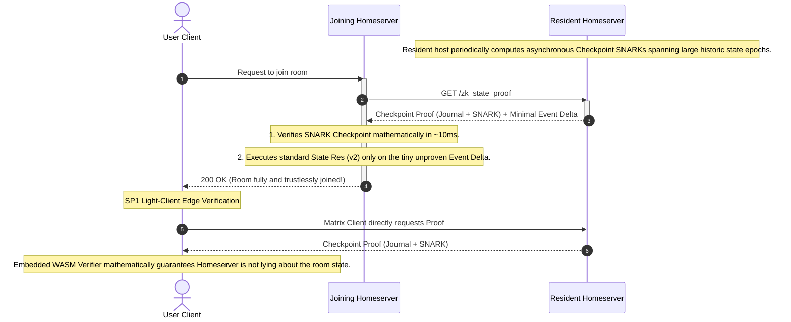

# MSC0000: Trustless ZK-SNARK Federated Room Joins via a16z/jolt

**Author:** [@gamesguru]
**Created:** [Sun 23 Mar 2026]
**Status:** Draft

## Introduction and Motivation

The Matrix protocol is built on a fully decentralized "don't trust, verify" architecture. Currently, when a homeserver joins a federated room, it has two theoretical paths:

1. **Full Join (Status Quo):** Download the entire multi-gigabyte historical Directed Acyclic Graph (DAG) known as the "Auth Chain" and locally execute the State Resolution v2 algorithm from the genesis event. While this guarantees trustlessness, it is computationally prohibitive and can take seconds or minutes (or longer) for massive rooms.
2. **Faster [Partial] Joins (MSC3902):** The server temporarily _blindly trusts_ the remote server's assertion of the "current state" so users can participate immediately. In the background, it syncs the multi-gigabyte Auth Chain. This compromises the immediate trustless nature of the network.

**The Solution:** This MSC proposes introducing Zero-Knowledge proofs (specifically STARK proofs generated by the **Jolt zkVM**) to securely prove State Resolution v2 execution. Jolt utilizes the **Lasso** lookup argument and **Sumcheck protocol** to model CPU execution as efficient lookups, fundamentally optimizing the topological sorting and bitwise operations required by Matrix. A prover node calculates the state resolution and outputs a succinct verifiable proof. The joining server merely downloads the current state map and this proof—verifying mathematical correctness in milliseconds without downloading the historical DAG.

## Proposed Endpoints

We propose a new versioned endpoint under the Federation API designed specifically for ZK-Joins.

### `GET /_matrix/federation/unstable/org.matrix.msc0000/zk_state_proof/{roomId}`

Retrieves the latest cryptographic state checkpoint for the specified room, alongside the unverified event delta since that checkpoint.

**Authentication:** Requires Server-Server signature.
**Rate-limiting:** Yes.

**Path Parameters:**

- `roomId` (string, required): The ID of the room to join (e.g. `!abcd:example.com`).

**Response Format:**

Returns an HTTP 200 OK with the following JSON body:

```json
{
  "room_version": "12",
  "checkpoint": {
    "event_id": "$historic_event_X",
    "resolved_state_root_hash": "<sha256_hash>",
    "zk_proof": "<base64_jolt_stark_proof>",
    "program_vkey": "<jolt_vkey_hash>"
  },
  "delta": {
    "recent_state_events": [
      {
        /* Raw State Event 1 (happened today) */
      },
      {
        /* Raw State Event 2 (happened today) */
      }
    ]
  }
}
```

**Response Payload Details:**

- `room_version` (string): The Matrix room version, which dictates the state resolution rules and allowed SP1 Guest ELF.
- `checkpoint` (object): The cryptographic rollup data spanning the room's history up to the cutoff.
  - `event_id` (string): The Matrix event ID representing the deterministic cutoff point for the SNARK rollup.
  - `resolved_state_root_hash` (string): The resulting Matrix state resolution output hash computed by the ZK program.
  - `zk_proof` (string): The base64-encoded, serialized Groth16 or Plonk SNARK receipt.
  - `image_id` (string): The canonical program hash (SP1 verification key hash) utilized to generate the proof. This MUST strictly adhere to the expected hash for this `room_version`.
- `delta` (object): The minimal, unverified Auth Chain events that have accumulated strictly after the `checkpoint.event_id`.
  - `recent_state_events` (array of objects): Standard Matrix state events (PDUs). The joining server will natively execute standard state resolution over these final events on top of the checkpoint.

**Error Responses:**

- `401 Unauthorized` (with `M_UNAUTHORIZED`): The Server-Server signature is missing or invalid.
- `404 Not Found` (with `M_NOT_FOUND`): The requested room is unknown to the resident server, or ZK proofs are not enabled/available for this room.
- `429 Too Many Requests` (with `M_LIMIT_EXCEEDED`): Rate limit exceeded.

## Interaction Sequence

Using a native Mermaid sequence diagram, we can visualize the exact flow of data during a trustless room join, illustrating the interactions between the joining server, the resident server, and edge clients.



## Program Consensus & Image IDs

If a joining server receives a zero-knowledge proof, it must know exactly which circuit program verified the logic. Otherwise, a malicious host could write a circuit that simply returns `true` and bypasses power levels.

**Rule:** Matrix Room Versions MUST dictate the allowed zkVM program.
_When joining Room Version 12 via ZK-Proof, the receiving server MUST assert that the SNARK receipt's `image_id` perfectly matches the protocol-defined canonical Hash of the official SP1 Guest ELF for Room Version 12._

## zkVM Mechanics: Host, Guest, and Receipts

A common source of skepticism around zero-knowledge proofs is: _"How do we know what was actually executed, and what are we trusting?"_ We are not trusting a traditional cryptographic "signature" tied to a server's identity. Instead, we are verifying a mathematical proof of _computational execution_.

- **Host-Guest Interaction:** The "Host" (the homeserver generating the proof) handles the heavy data extraction and provides the Matrix Auth Chain as private inputs to the "Guest" (the compiled zkVM circuit). The Guest is mathematically constrained and cannot deviate from its compiled code (`image_id`).
- **The Journal & Public Outputs:** During execution, the Guest reads the unverified Matrix Events. Once it finishes state resolution, it "commits" public variables to a structure known as the **Journal**. In this protocol, the Journal strictly contains:
  1. The Starting Room State Hash (Input State)
  2. The Final Resolved Room State Hash (Output State)
- **The Receipt:** The STARK/SNARK prover finishes and generates a **Receipt**. The Receipt bundles the Journal, the `image_id` (program hash), and the cryptographic proof. Any verifier can examine the Receipt and confidently assert: _"I see this proof guarantees that running the program `[image_id]` on starting state `[A]` deterministically yields end state `[B]`."_ The verifier never downloads the thousands of events between A and B, but cryptographic binding forces the receipt to be mathematically invalid if the Host tampered with the event logic or skipped constraints.

## Epoch Rollups and Determinism

To prevent unacceptable CPU load, homeservers MUST NOT generate ZK proofs synchronously during a federation or client join request. Instead, they generate "Rollups" at periodic cutoff points (e.g., bi-weekly or every 10,000 events).

**How a cutoff works:**
A Rollup takes a historically established Room State (e.g., from exactly two weeks ago) as its genesis input. It then processes the entire DAG delta up to the current cutoff point, enforcing Matrix auth rules and resolving conflicts. The output is a new resolved state hash, representing the new checkpoint.

**Determinism:**
Matrix State Resolution (v2) is strictly deterministic. If three different homeservers independently generate a rollup for the exact same two-week window of events, they will all compute the exact same final `resolved_state_root_hash`. While the underlying SNARK proof's binary payload might differ due to cryptographic randomness, anyone verifying those receipts will accept the exact same Output State.

When serving a `/zk_state_proof` request, the resident server returns the most recent Checkpoint Proof alongside the minimal, unproven Auth Chain delta that has accumulated since that checkpoint. The joining server cryptographically verifies the Checkpoint in `O(1)` time, and natively resolves the tiny unproven event delta in trivial `O(N)` time. This "Hybrid Verification" guarantees 100% trustless state while allowing heavy proof generation to happen entirely asynchronously offline.

## The Light Client Angle

A crucial secondary benefit of migrating complex state resolution to a SNARK proof is that verifiers are extremely lightweight. The SP1 Growth16 verifier (`ark-bn254` based) is compiled entirely to WebAssembly (WASM).

This allows clients like **Element Web** or mobile browsers to verify the state of a room _trustlessly_ in 10-15 milliseconds. A client no longer has to trust that its connected Homeserver isn't lying about the room state—it can verify the ZK-Proof directly on the edge device, shifting Matrix closer to a true peer-to-peer paradigm.

## Security Considerations

- **Malicious Circuits:** If the joining server does not enforce a strict manifest correlating the room version to a specific, audited verifier image ID (ELF hash), a malicious homeserver could provide a fake SNARK proof generated from a dummy program that simply returns `true`. The protocol MUST specify canonical image IDs per room version.
- **Data Availability:** While the ZK proof asserts that a valid state resolution occurred, it does not guarantee that the events referenced in the state actually exist or are available for download. A malicious server could withhold the underlying data (a Data Availability attack).
- **Power Level Bypassing:** The circuit constraints MUST be thoroughly audited strictly against Matrix's `m.room.power_levels` rules. If a vulnerability exists in the guest program, a malicious sender could forge a valid proof that illegitimately elevates their permissions.

## Unstable Prefix

While this MSC is in development and has not yet been merged into the official Matrix specification, the endpoint will use the `org.matrix.msc0000` prefix. For example: `/_matrix/federation/unstable/org.matrix.msc0000/zk_state_proof/{roomId}`.

## Dependencies

- This proposal builds upon the partial join mechanisms discussed in **MSC3902**, providing a trustless cryptographic guarantee to the "fast join" assumption.

---

## MSC Checklist

This document contains a list of final checks to perform on an MSC before it
is accepted. The purpose is to prevent small clarifications needing to be
made to the MSC after it has already been accepted.

Spec Core Team (SCT) members, please ensure that all of the following checks
pass before accepting a given Matrix Spec Change (MSC).

MSC authors, feel free to ask in a thread on your PR or in the
[#matrix-spec:matrix.org](https://matrix.to/#/#matrix-spec:matrix.org) room for
clarification of any of these points.

- [ ] Are [appropriate implementation(s)](https://spec.matrix.org/proposals/#implementing-a-proposal) specified in the MSC’s PR description?
- [ ] Are all MSCs that this MSC depends on already accepted?
- [ ] For each endpoint that is introduced or modified:
  - [ ] Have authentication requirements been specified?
  - [ ] Have rate-limiting requirements been specified?
  - [ ] Have guest access requirements been specified?
  - [ ] Are error responses specified?
    - [ ] Does each error case have a specified `errcode` (e.g. `M_FORBIDDEN`) and HTTP status code?
      - [ ] If a new `errcode` is introduced, is it clear that it is new?
  - [ ] Are the [endpoint conventions](https://spec.matrix.org/latest/appendices/#conventions-for-matrix-apis) honoured?
    - [ ] Do HTTP endpoints `use_underscores_like_this`?
    - [ ] Will the endpoint return unbounded data? If so, has pagination been considered?
    - [ ] If the endpoint utilises pagination, is it consistent with [the appendices](https://spec.matrix.org/latest/appendices/#pagination)?
- [ ] Will the MSC require a new room version, and if so, has that been made clear?
  - [ ] Is the reason for a new room version clearly stated? For example, modifying the set of redacted fields changes how event IDs are calculated, thus requiring a new room version.
- [ ] Are backwards-compatibility concerns appropriately addressed?
- [ ] An introduction exists and clearly outlines the problem being solved. Ideally, the first paragraph should be understandable by a non-technical audience.
- [ ] All outstanding threads are resolved
  - [ ] All feedback is incorporated into the proposal text itself, either as a fix or noted as an alternative
- [ ] There is a dedicated "Security Considerations" section which detail any possible attacks/vulnerabilities this proposal may introduce, even if this is "None.". See [RFC3552](https://datatracker.ietf.org/doc/html/rfc3552) for things to think about, but in particular pay attention to the [OWASP Top Ten](https://owasp.org/www-project-top-ten/).
- [ ] The other section headings in the template are optional, but even if they are omitted, the relevant details should still be considered somewhere in the text of the proposal. Those section headings are:
  - [ ] Introduction
  - [ ] Proposal text
  - [ ] Potential issues
  - [ ] Alternatives
  - [ ] Unstable prefix
  - [ ] Dependencies
- [ ] Stable identifiers are used throughout the proposal, except for the unstable prefix section
  - [ ] Unstable prefixes [consider](https://github.com/matrix-org/matrix-spec-proposals/blob/main/README.md#unstable-prefixes) the awkward accepted-but-not-merged state
  - [ ] Chosen unstable prefixes do not pollute any global namespace (use “org.matrix.mscXXXX”, not “org.matrix”).
- [ ] Changes have applicable [Sign Off](https://github.com/matrix-org/matrix-spec-proposals/blob/main/CONTRIBUTING.md#sign-off) from all authors/editors/contributors
