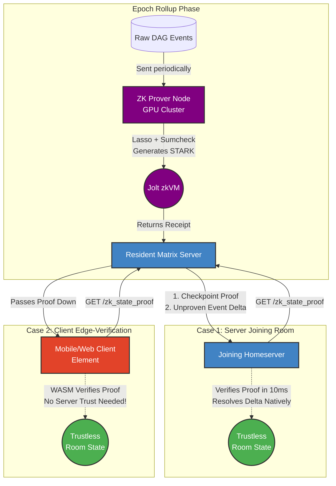

# ZK-Matrix-Join: Trustless Matrix Light Clients

[](https://github.com/gamesguru/matrix-zk-stark-dag-demo/actions/workflows/ci.yml) [](#) [](#) [](#)

A Layer-2 Zero-Knowledge scaling solution for the Matrix protocol powered by **a16z's Jolt VM**.

We're replacing slow **Full Joins** and insecure **Partial Joins** with instant, cryptographically secure **ZK-Joins**.

## The Problem

Joining a massive Matrix room (like `#matrix:matrix.org`) sucks. You either:

1. **Download the universe (Full Join):** Crunch hundreds of thousands of events from genesis. Kills your RAM, CPU, and takes forever.
2. **YOLO it (MSC3902):** Blindly trust the remote server's state so you can chat now, verifying gigabytes in the background. A huge compromise on decentralization.

## The Solution: Math > Computation

`zk-matrix-join` moves Matrix state resolution into a Zero-Knowledge architecture.

A beefy prover node crunches the heavy State Res v2 logic inside the **Jolt zkVM**. Jolt utilizes the **Lasso** lookup argument and **Sumcheck protocol** to generate proofs that are significantly faster and "leaner" than traditional arithmetization-based zkVMs.

Instead of downloading 50MB of Auth Chain and verifying 500k signatures, servers (and browser light clients) just download the 2MB state and a tiny STARK proof. They verify it in **milliseconds**.

## Architecture



Built on **Jolt RV64IMAC**, allowing formally verified Rust libraries (`ruma-lean`) to run in ZK.

- **`src/host/` (The Prover):** Orchestrates state res and parallelizes the Jolt Prover.
- **`src/guest/` (The zkVM):** Formally verified logic that runs inside Jolt, proving topological compliance and state transitions.
- **`src/wasm-client/` (The Verifier):** Exposes proof verification to WebAssembly (Currently in Simulation mode).

## API Specification

We propose new endpoints to securely retrieve these ZK rollups.

### 1. Server-to-Server (Federation API)

When a Matrix homeserver joins a room, it requests the proof from a resident server.

**Request:**

```http
GET /_matrix/federation/unstable/org.matrix.msc0000/zk_state_proof/!room:example.com
Authorization: X-Matrix origin="joining.server",key="...",sig="..."
```

### 2. Client-to-Server (Client-Server API)

The homeserver generously passes this exact proof down to end-user clients (Element, etc.) so they can perform edge-verification.

**Example Response:**

```json
{
  "room_version": "12",
  "checkpoint": {
    "event_id": "$historic_cutoff",
    "resolved_state_root_hash": "<sha256_hash>",
    "zk_proof": "<jolt_stark_proof>",
    "program_vkey": "<jolt_vkey>"
  },
  "delta": {
    "recent_state_events": [ ... ]
  }
}
```

## Project Architecture

- [Architectural Paths](docs/architectural-paths.md): High-level overview of our Jolt-centric ZK strategy.
- [Topological Reducer Speedup](docs/topological-reducer-speedup.md): How Jolt's lookup table approach optimizes Matrix DAG resolution.

## Configuration

You can configure the execution mode using environment variables:

- `JOLT_PROVE=1`: Generates a full STARK proof (High CPU/RAM).
- `EXECUTE_UNOPTIMIZED=1`: Runs the full Matrix Spec State Res v2 instead of the Optimized Topological Reducer.

Example usage:

```bash
JOLT_PROVE=1 cargo run --bin ruma-zk-host
```

## Security & Memory Safety

To cryptographically neutralize VM-level exploits, **the entire workspace (Guest, Host, and WASM Verifier)** strictly bans `unsafe` Rust via the `#![forbid(unsafe_code)]` compiler directive. All resolution logic is offloaded to `ruma-lean`, a zero-dependency crate designed for formal verification.

## Development

### Code Coverage

To generate a code coverage report:

```bash
make coverage
```

### Parity Testing

To run the Jolt parity simulation (comparing native Rust vs. proven Guest):

```bash
make test-zk
```

## License

Dual-licensed under MIT or Apache 2.0.
