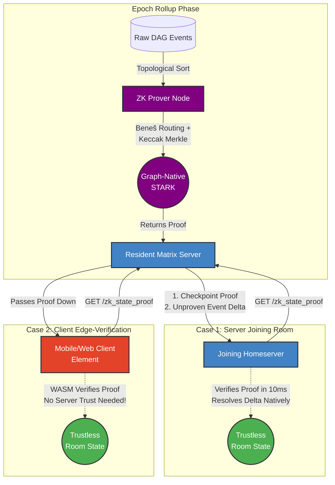

# ZK-Matrix-Join: Trustless Matrix Light Clients

[](https://github.com/gamesguru/ruma-zk/actions/workflows/ci.yml) [](#) [](#) [](#)

A Layer-2 Zero-Knowledge scaling solution for the Matrix protocol powered by **Graph-Native STARKs** over binary fields (GF(2)).

We're replacing slow **Full Joins** and insecure **Partial Joins** with instant, cryptographically secure **ZK-Joins**.

## The Problem

Joining a massive Matrix room (like `#matrix:matrix.org`) sucks. You either:

1. **Download the universe (Full Join):** Crunch hundreds of thousands of events from genesis. Kills your RAM, CPU, and takes forever.
2. **YOLO it (MSC3902):** Blindly trust the remote server's state so you can chat now, verifying gigabytes in the background. A huge compromise on decentralization.

## The Solution: Math > Computation

`zk-matrix-join` moves Matrix state resolution into a Zero-Knowledge architecture.

A beefy prover node crunches the heavy State Res v2 logic inside a **Graph-Native STARK** circuit. The circuit uses a Beneš routing network to prove topological compliance, with Keccak-256 Merkle commitments and XOR-stretch expander graphs for proximity amplification.

Instead of downloading 50MB of Auth Chain and verifying 500k signatures, servers (and browser light clients) just download the 2MB state and a tiny STARK proof. They verify it in **milliseconds**.

## Architecture



### Workspace Crates

- **`ruma-zk-prover`**: Core prover/verifier SDK — Beneš routing, Keccak circuit, expander graph, recursive composition.
- **`ruma-zk-topological-air`**: Algebraic Intermediate Representation — GF(2) field, topological sort, event definitions.
- **`ruma-zk-verifier`**: WASM-compatible proof verifier for browser and edge clients.
- **`ruma-lean`**: Formally verified state resolution logic in Lean 4, compiled to native Rust FFI.

## Proof Tiers

We support three levels of proof compression to balance proving time vs. verification cost:

1.  **Raw STARK (Uncompressed):** The native output. Fastest to generate (~seconds), large size (~MBs). Ideal for server-to-server synchronization where bandwidth is cheap.
2.  **Recursive STARK (Intermediate):** STARK-in-STARK recursive composition via Keccak-f[1600] circuit. Parent proofs embed sub-proof verification as additional trace columns.
3.  **Groth16 SNARK (Compressed):** The "Gold Standard" for edge-verification. Smallest size (~200 bytes), can be verified on-chain (EVM) or in standard browsers via WASM in milliseconds. _(Planned — follow-up MSC.)_

## API Specification (Proposed)

See [MSC0000](MSC0000-zk-proven-room-joins.md) for the full specification.

### `GET /_matrix/federation/unstable/org.matrix.msc0000/zk_state_proof/{roomId}`

Retrieves the trustless state checkpoint for a room.

```json
{
  "room_version": "12",
  "vk_hash": "sha256:<hex_digest>",
  "checkpoint": {
    "public_journal": {
      "da_root": "0xc29ab9db...",
      "state_root": "0x259df515...",
      "h_auth": "0x7f3a1b2c...",
      "n_events": 43543,
      "parent_proofs": ["0x...", "0x..."]
    },
    "zk_proof_bytes": "<base64_stark_proof>"
  },
  "delta": {
    "recent_state_events": [
      /* ... */
    ]
  }
}
```

## CLI Usage

```bash
cargo run --release --bin ruma-zk-prover -- [COMMAND]
```

### Commands:

- **`demo`**: Run a fast end-to-end simulation.
  ```bash
  ruma-zk-prover demo -i res/benchmark_1k.json
  ```

## Development

```bash
make format   # prettier + cargo fmt + clippy
make lint     # cargo clippy (0 warnings enforced)
make test     # 176 tests across workspace (~30s debug)
make lean     # Lean 4 formal verification build
```

### Code Coverage

```bash
make coverage
```

## Security & Memory Safety

To cryptographically neutralize VM-level exploits, **the entire workspace (Prover, Verifier, and WASM)** strictly bans `unsafe` Rust via the `#![forbid(unsafe_code)]` compiler directive. All resolution logic is offloaded to `ruma-lean`, a zero-dependency crate designed for formal verification.

## License

Dual-licensed under MIT or Apache 2.0.
